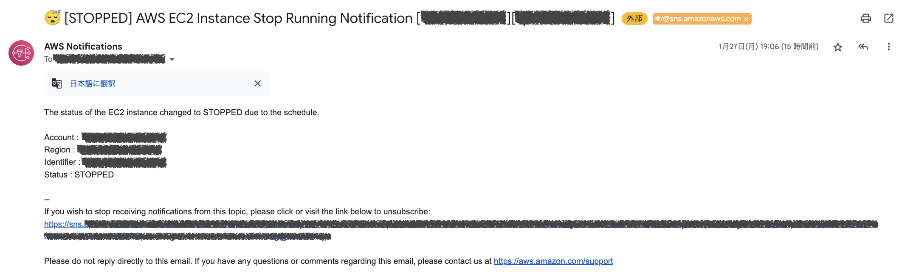
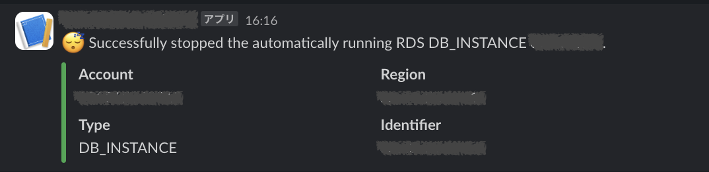

# AWS RDS Database Auto Running Protection Stack

[](https://github.com/gammarers/aws-rds-database-auto-running-protection-stack/blob/main/LICENSE)
[](https://www.npmjs.com/package/@gammarers/aws-rds-database-auto-running-protection-stack)
[](https://github.com/gammarers/aws-rds-database-auto-running-protection-stack/actions/workflows/release.yml)
[](https://github.com/gammarers/aws-rds-database-auto-running-protection-stack/releases)

[](https://constructs.dev/packages/@gammarers/aws-rds-database-auto-running-protection-stack)

This constructor stack includes a function to automatically stop a database or cluster that will automatically start in 7 days.

> [!WARNING]
> v2.1.0:
> Stack props add option resourceNamingOption
> default ResourceNamingType.DEFAULT is cdk generated name
> if you want to maintain compatibility with versions below `v2.1.0`, please include the following settings (ResourceNamingType.AUTO).
> ```typescript
> new RDSDatabaseAutoRunningProtectionStack(app, 'RDSDatabaseAutoRunningProtectionStack', {
>   stackName: 'rds-database-auto-running-protection-stack',
>   targetResource: {
>     tagKey: 'AutoRunningProtection',
>     tagValues: ['YES'],
>   },
>   resourceNamingOption: {
>     type: RDSDatabaseAutoRunningProtectionStackResourceNamingType.AUTO, // HERE
>   },
> });
> ```

## Resources

This construct creating resource list.

- StepFunctions(StateMachine)
- IAM Role (StepFunctions)
- IAM Policy (StepFunctions)
- EventBridge
- IAM Role (EventBridge)

## Install

### TypeScript

#### install by npm

```shell
npm install @gammarers/aws-rds-database-auto-running-protection-stack
```

#### install by yarn

```shell
yarn add @gammarers/aws-rds-database-auto-running-protection-stack
```

#### install by pnpm

```shell
pnpm add @gammarers/aws-rds-database-auto-running-protection-stack
```

#### install by bun

```shell
bun add @gammarers/aws-rds-database-auto-running-protection-stack
```

## Example

### Code

```typescript
import { RDSDatabaseAutoRunningProtectionStack } from '@gammarers/aws-rds-database-auto-running-protection-stack';

new RDSDatabaseAutoRunningProtectionStack(app, 'RDSDatabaseAutoRunningProtectionStack', {
  stackName: 'rds-database-auto-running-protection-stack',
  targetResource: {
    tagKey: 'AutoRunningProtection',
    tagValues: ['YES'],
  },
  resourceNamingOption: {
    type: RDSDatabaseAutoRunningProtectionStackResourceNamingType.DEFAULT,
  },
  notifications: {
    emails: [ // "Incoming Sample Message - EMAIL"
      'foo@example.com',
      'bar@example.net',
    ],
    slack: { // "Incoming Sample Message - Slack"
      webhookSecretName: 'example/slack/webhook', // Slack webhook secret
    },
  },
});
```

### Slack webhook secret

Please save it in AWS Secrets Manager in the following format.

get your slack webhook url parts

```text
https://hooks.slack.com/services/<workspace>/<channel>/<whebook>
```

| SecretKey 	 | SecretValue 	   |
|-------------|-----------------|
| Workspace 	 | \<workspace\> 	 |
| Channel   	 | \<channel\>   	 |
| Webhook   	 | \<whebook\>   	 |

## Incoming Sample Message

### EMAIL



### Slack



## License

This project is licensed under the Apache-2.0 License.
